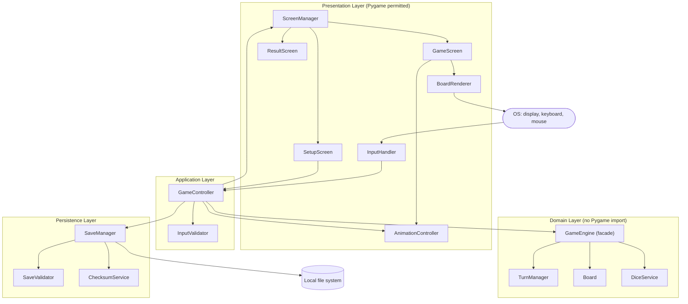
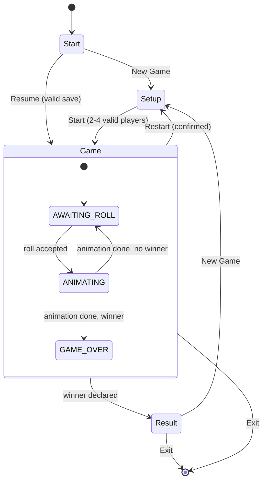
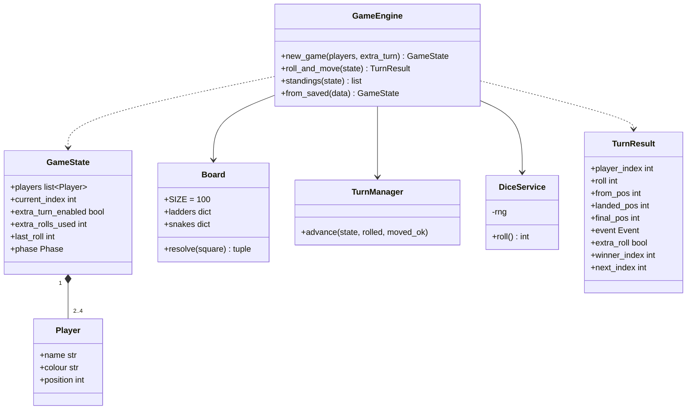
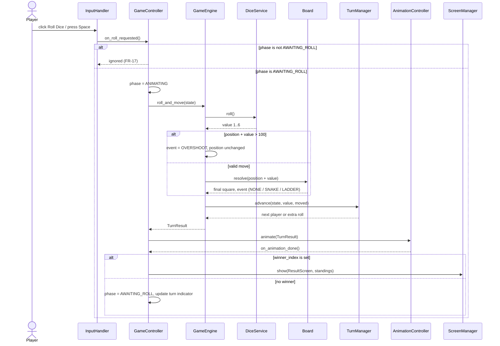
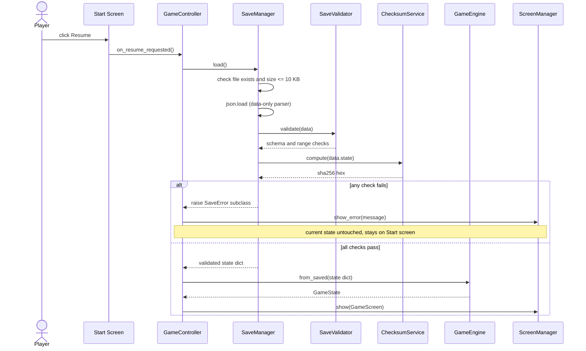
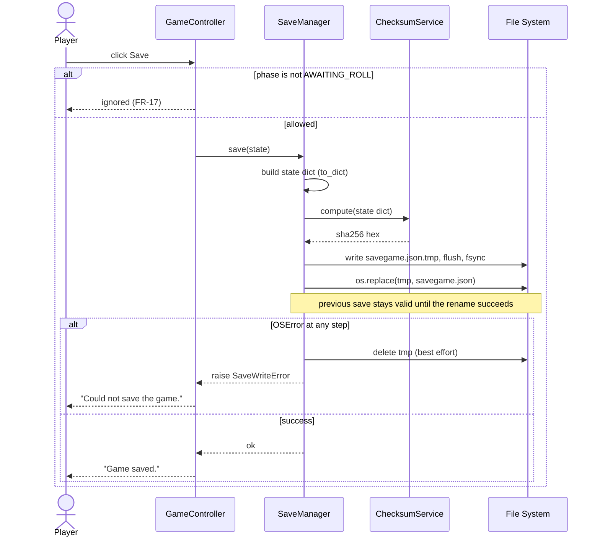

# Software Architecture & Design Specification

## Snakes and Ladders Game

**Version**: 1.0 **Date**: 29 September 2026
**Format**: Based on IEEE Std 1016-2009 (Software Design Descriptions)
**Baseline**: SRS v1.0 (`SRS.md`)

| Name               | SRN           |
| ------------------ | ------------- |
| Shishir Hegde      | PES1UG24CS438 |
| Shaurya Singh      | PES1UG24CS437 |
| Sharat Doddihal    | PES1UG24CS430 |
| Shashank Palcharla | PES1UG24CS436 |

---

## Revision History

| Version | Date       | Description                             | Author(s) |
| ------- | ---------- | --------------------------------------- | --------- |
| 1.0     | 29-09-2026 | Initial architecture and design         | Team      |

---

## 1. Introduction

### 1.1 Purpose
This document describes the software architecture and detailed design of the Snakes and Ladders desktop game specified in the SRS. It is intended for the development and test team and is the baseline for implementation and for the test-case update to the Test Plan.

### 1.2 Scope
It covers the structure of the system (components, pattern, security architecture) and its detailed design (sequence diagrams, module interfaces, data formats, error handling). It does not cover user documentation or deployment packaging.

### 1.3 Definitions and Abbreviations
Terms from SRS Section 1.3 apply. Additional terms:

| Term       | Definition                                                                   |
| ---------- | ---------------------------------------------------------------------------- |
| Phase      | Engine-level state: `AWAITING_ROLL`, `ANIMATING`, `GAME_OVER`                |
| TurnResult | Immutable record returned by the engine describing everything a roll caused |
| Atomic save | Write to a temporary file, then rename over the target in one OS operation |
| ADR        | Architecture Decision Record                                                 |

### 1.4 References
1. SRS v1.0, Snakes and Ladders Game (`SRS.md`).
2. IEEE Std 1016-2009, Software Design Descriptions.
3. Pygame 2.x documentation. Python 3.10 standard library documentation.

### 1.5 Overview
Section 2 gives the architecture. Section 3 gives the detailed design. Section 4 gives requirement traceability. Section 5 lists design decisions and assumptions.

---

## 2. Architecture

### 2.1 Architectural Drivers
| Driver | Source | Architectural consequence |
| ------ | ------ | ------------------------- |
| Rule logic testable without a display | C4, NFR-06 | Separate Pygame-free domain layer |
| Offline only, no sockets | C2, SEC-06, NFR-04 | No networking modules anywhere; a test asserts this |
| JSON saves, tamper-evident, size-limited | C3, SEC-02, SEC-03, NFR-14 | Dedicated persistence layer with validator and checksum service |
| Dice must not be settable from outside | SEC-04, NFR-15 | Dice service is private to the engine |
| Never crash, always recoverable | NFR-10, NFR-11 | Exception hierarchy, atomic save, top-level guard |
| Responsive, at least 30 FPS, at most 1 s | NFR-01, NFR-12 | Engine resolves a roll instantly; UI only animates the result |
| Cross-platform | NFR-05 | `pathlib`, no OS-specific calls, Pygame only for I/O |

### 2.2 Architectural Pattern
**Layered architecture (4 layers) with an MVC-style presentation split.**

* **Presentation layer (View + input):** Pygame screens, renderer, input handler, animation.
* **Application layer (Controller):** `GameController` orchestrates use cases and enforces the phase guard.
* **Domain layer (Model):** `GameEngine`, `Board`, `TurnManager`, `DiceService`. No Pygame imports.
* **Persistence layer:** save, load, validate, checksum.

Dependency rule: each layer may depend only on the layer directly beneath it, and the domain layer depends on nothing else. The UI never calls the engine directly; every user action goes through `GameController`. Two supporting patterns are used: a **Facade** (`GameEngine` is the single entry point to rules) and a **State pattern** for screens (`ScreenManager`).

**Why this pattern:** it directly satisfies C4 and NFR-06 (engine testable headless), keeps the four-person team from stepping on each other (one owner per layer), and gives a single choke point for security checks (controller for input, `SaveManager` for files).

### 2.3 Component Diagram



### 2.4 Component Descriptions

| ID  | Component | Layer | Responsibility | Key collaborators |
| --- | --------- | ----- | -------------- | ----------------- |
| C1  | `ScreenManager` | Presentation | Holds the active screen (Start, Setup, Game, Result, Error dialog) and switches between them | Screens, GameController |
| C2  | `SetupScreen` | Presentation | Collects player count, names, colours, extra-turn toggle; disables Start until valid | GameController |
| C3  | `GameScreen` | Presentation | Draws board, tokens, roll button, last dice value, turn indicator, Save/Restart/Exit | BoardRenderer, AnimationController |
| C4  | `ResultScreen` | Presentation | Shows winner and ranked standings; New Game and Exit | GameController |
| C5  | `BoardRenderer` | Presentation | Maps squares 1 to 100 to pixel coordinates (boustrophedon), scales for 1280x720 to 1920x1080, draws snakes, ladders, tokens with number labels | Board (read-only data) |
| C6  | `InputHandler` | Presentation | Converts mouse click and Space key into controller calls. Contains no game logic | GameController |
| C7  | `AnimationController` | Presentation | Animates token movement at 30 FPS or better and reports completion | GameController |
| C8  | `GameController` | Application | Implements use cases (new game, roll, save, resume, restart, exit). Holds the phase guard (FR-17). Catches domain and persistence exceptions and turns them into UI messages | All layers |
| C9  | `InputValidator` | Application | Validates names (SEC-01), unique names and colours (FR-02), player count (FR-01) | GameController |
| C10 | `GameEngine` | Domain | Facade. `new_game`, `roll_and_move`, `standings`. Applies move, overshoot, snake/ladder, win check, turn advance | TurnManager, Board, DiceService |
| C11 | `Board` | Domain | Immutable 10x10 board, snake and ladder maps from Appendix 4.3, `resolve(square)` | GameEngine |
| C12 | `TurnManager` | Domain | Current player, extra-turn counter (max 2), advance turn | GameEngine |
| C13 | `DiceService` | Domain | The only source of dice values; uniform 1 to 6 using `secrets.SystemRandom` | GameEngine |
| C14 | `SaveManager` | Persistence | Serialise, atomic write, size-limited read, orchestrates validation | SaveValidator, ChecksumService |
| C15 | `SaveValidator` | Persistence | Size, JSON, schema, range checks (SEC-03) | SaveManager |
| C16 | `ChecksumService` | Persistence | SHA-256 over canonical JSON of the state (SEC-02) | SaveManager |

### 2.5 Source Layout (enforces layering)

```
snakes_ladders/
  main.py                 # composition root: builds and wires components
  ui/                     # may import pygame
  controller/             # GameController, InputValidator
  engine/                 # must NOT import pygame (checked in CI, NFR-06)
  persistence/            # json, hashlib, pathlib, os only
tests/
  engine/  persistence/  controller/  ui_smoke/
```

### 2.6 Traceability of Architecture to Requirements

| Requirement | Architectural element |
| ----------- | --------------------- |
| C1, C2, NFR-04, SEC-06 | Python + Pygame only; no networking imports in any layer |
| C3, NFR-14 | `persistence/` JSON format, compact schema (Section 3.5) |
| C4, NFR-06 | `engine/` layer isolated from Pygame; import rule checked in CI |
| FR-01, FR-02, SEC-01 | C2, C9 |
| FR-03, NFR-15, SEC-04 | C13 inside C10; no setter exposed |
| FR-04, FR-06, FR-07, FR-09, FR-10 | C10, C11 |
| FR-05, FR-08 | C12 |
| FR-11, NFR-09, NFR-13 | C5, C3 |
| FR-12 | C3 |
| FR-13, NFR-01, NFR-12 | C7 (engine result is instant, UI only animates) |
| FR-14, FR-18 | C8, C1 |
| FR-15, NFR-08, NFR-11, SEC-02, SEC-03, SEC-05 | C14, C15, C16 |
| FR-16 | C4, `GameEngine.standings` |
| FR-17 | C8 phase guard, C6 |
| NFR-03, NFR-07 | C10 invariants, automated full-game tests |
| NFR-05 | `pathlib`, no OS-specific code, Pygame abstractions |
| NFR-10 | Exception hierarchy and top-level guard (Section 3.4) |

The complete requirement-to-design matrix is in Section 4.

### 2.7 Security Architecture

**Security posture:** offline, single-user, no accounts. The attack surface is (1) keyboard text input, (2) the save file on disk, and (3) the integrity of the dice.

**Trust boundaries**

| Boundary | Untrusted side | Trusted side | Gatekeeper |
| -------- | -------------- | ------------ | ---------- |
| TB-1 | Keyboard/mouse input | Application layer | `InputValidator`, `GameController` phase guard |
| TB-2 | Save file on disk | Domain state | `SaveManager` → `SaveValidator` → `ChecksumService` |
| TB-3 | Rest of the application | Dice values | `DiceService` (private to engine) |
| TB-4 | The machine's network stack | The application | No sockets opened at all |

**Security controls by requirement**

| Req | Objective | Control | Component | Where enforced |
| --- | --------- | ------- | --------- | -------------- |
| SEC-01 | SO-3 | Allow-list regex `^[A-Za-z0-9 ]{1,15}$`, whitespace-only names rejected | C9 | At setup, and again on load (defence in depth) |
| SEC-02 | SO-1 | SHA-256 of canonical JSON stored on save, recomputed on load, mismatch refuses load | C16, C14 | TB-2 |
| SEC-03 | SO-1, SO-3 | Ordered validation: size ≤ 10 KB → JSON parse → schema/types → ranges → checksum. Current state untouched until all checks pass | C15, C14 | TB-2 |
| SEC-04 | SO-2 | `DiceService` has no public setter; `roll_and_move` takes no dice argument; the RNG is injected only in `main.py` (real) or in unit tests (seeded) | C13, C10 | TB-3 |
| SEC-05 | SO-3 | `json.load` only; `eval`, `exec`, `pickle`, `yaml.load` banned; enforced by a grep check in CI | C14 | TB-2 |
| SEC-06 | SO-4 | No `socket`, `urllib`, `http`, `requests` imports; CI grep check and a runtime test with sockets patched to raise | All | TB-4 |

**Secure design principles applied:** allow-list validation, fail closed (any validation failure rejects the file), least privilege (the app reads and writes only its own save directory), defence in depth (validation at setup and at load), and no state mutation before validation succeeds.

**Known limitation (to be stated honestly in the report):** an unkeyed SHA-256 checksum detects accidental corruption and casual edits, but a determined user who edits the state and recomputes the hash can still forge a save. This is accepted because the game is a single-device hot-seat game with no rewards or accounts (SO-1 is "not silently altered", not "cryptographically unforgeable"). An HMAC with an embedded key would not materially improve this.

### 2.8 Deployment View
A single OS process on the player's machine. The only external resource is a per-user save directory: `%APPDATA%/SnakesLadders` (Windows), `~/.local/share/SnakesLadders` (Linux), `~/Library/Application Support/SnakesLadders` (macOS). The file is `savegame.json`; the temp file is `savegame.json.tmp`.

---

## 3. Design

### 3.1 Game Phases and Screen Flow



`GameController` accepts a roll only in `AWAITING_ROLL` and a save only in `AWAITING_ROLL` (FR-17). All other attempts are ignored and logged.

### 3.2 Class Design (Domain Layer)



**Roll algorithm (`roll_and_move`)**

1. `roll = dice.roll()`
2. `target = player.position + roll`
3. If `target > 100`: event = `OVERSHOOT`, position unchanged, turn advances, no extra roll (FR-10 takes precedence over FR-08).
4. Else `landed = target`; `final, event = board.resolve(landed)` (`SNAKE`, `LADDER` or `NONE`). Set `player.position = final` (FR-04, FR-06, FR-07).
5. If `final == 100`: winner = current player; phase = `GAME_OVER` (FR-09).
6. Else if `extra_turn_enabled and roll == 6 and extra_rolls_used < 2`: extra roll granted, counter incremented, same player stays (FR-08).
7. Else the turn advances and the counter resets (FR-05).
8. Return an immutable `TurnResult`.

**Invariants** (asserted in tests for NFR-03): `0 ≤ position ≤ 100`; `0 ≤ current_index < len(players)`; only one winner; no player is ever on a snake head or ladder base after a move completes.

### 3.3 UML Sequence Diagrams

#### SD-1: Roll Dice (UC3; FR-03 to FR-10, FR-13, FR-17, SEC-04)



#### SD-2: Resume Game with Validation (UC10; FR-15, NFR-08, SEC-02, SEC-03, SEC-05)



#### SD-3: Save Game, Atomic Write (FR-15, NFR-11, NFR-14)



### 3.4 Error Handling Design

**Principles:** validate at the boundary; fail closed; never mutate live state before validation completes; never show a stack trace to the user; always return to a usable screen (NFR-10).

**Exception hierarchy**

```
SnlError (base)
├── InputValidationError        # name/colour/player-count problems
├── InvalidActionError          # action not allowed in current phase (silent, logged)
├── SaveError
│   ├── SaveNotFoundError
│   ├── SaveTooLargeError
│   ├── SaveFormatError         # bad JSON or schema
│   ├── SaveRangeError          # values out of range
│   ├── SaveIntegrityError      # checksum mismatch
│   └── SaveWriteError          # OS error while saving
└── EngineInvariantError        # should never happen; indicates a bug
```

**Error catalogue**

| Code | Condition | Exception | User-visible message | Recovery | SRS ref |
| ---- | --------- | --------- | -------------------- | -------- | ------- |
| E-01 | Name empty, over 15 chars or contains disallowed characters | `InputValidationError` | "Names must be 1 to 15 letters, digits or spaces." | Field highlighted; Start stays disabled | SEC-01, FR-02 |
| E-02 | Duplicate name or colour | `InputValidationError` | "Each player needs a unique name and colour." | Stay on Setup | FR-02 |
| E-03 | Fewer than 2 players | (UI guard) | Start button disabled | Add players | FR-01 |
| E-04 | Roll/save while not allowed | `InvalidActionError` | None (ignored, logged at DEBUG) | No state change | FR-17 |
| E-05 | Resume with no save file | `SaveNotFoundError` | "No saved game found." | Resume button hidden or disabled | UI-4 |
| E-06 | Save file over 10 KB | `SaveTooLargeError` | "Save file is corrupted or has been modified." | Stay on Start | SEC-03 |
| E-07 | Invalid JSON or wrong schema | `SaveFormatError` | "Save file is corrupted or has been modified." | Stay on Start | SEC-03, NFR-10 |
| E-08 | Field out of range | `SaveRangeError` | "Save file is corrupted or has been modified." | Stay on Start | SEC-03 |
| E-09 | Checksum mismatch | `SaveIntegrityError` | "Save file is corrupted or has been modified." | Stay on Start | SEC-02 |
| E-10 | OS error writing save | `SaveWriteError` | "Could not save the game." | Previous save intact; game continues | NFR-11 |
| E-11 | Engine invariant broken | `EngineInvariantError` | "An unexpected error occurred. Returning to the start screen." | Log, reset to Start | NFR-03, NFR-10 |
| E-12 | Any other unhandled exception in the main loop | `Exception` (top-level guard) | Same as E-11 | Log with traceback to `snl.log`; return to Start | NFR-10 |

The message text for E-06 to E-09 is deliberately identical, which satisfies SEC-02 and avoids telling an attacker which check failed. The specific code is written to the log only.

### 3.5 Data Design

**Save file (`savegame.json`, at most 10 KB, format version 1)**

```json
{
  "version": 1,
  "state": {
    "players": [
      {"name": "Asha", "colour": "red", "position": 37},
      {"name": "Ravi", "colour": "blue", "position": 12}
    ],
    "current_index": 1,
    "extra_turn_enabled": true,
    "extra_rolls_used": 0,
    "last_roll": 4
  },
  "checksum": "9f2c...64 hex characters..."
}
```

**Checksum definition:** `sha256(json.dumps(state, sort_keys=True, separators=(",", ":")).encode("utf-8")).hexdigest()`. Canonical serialisation makes the hash independent of whitespace and key order (needed for NFR-08 round-trips).

**Load validation rules**

| Field | Rule |
| ----- | ---- |
| `version` | Integer equal to 1 |
| `players` | List of 2 to 4 entries |
| `name` | Matches SEC-01 pattern; names unique |
| `colour` | One of the allowed colour set; colours unique |
| `position` | Integer, 0 to 100 |
| `current_index` | Integer, 0 to (players − 1) |
| `extra_turn_enabled` | Boolean |
| `extra_rolls_used` | Integer, 0 to 2 |
| `last_roll` | Integer 1 to 6 or `null` |
| Extra keys | Rejected (allow-list schema) |
| A saved game with a position of 100 | Rejected (a finished game cannot be resumed) |

### 3.6 API Design

The application is offline (C2, SEC-06), so there are **no network or REST APIs**. The "API" is the set of internal module interfaces between layers. These are the contracts that the team codes against and that tests call.

#### 3.6.1 Presentation → Application: `GameController`

| Method | Purpose | Preconditions | Returns | Errors surfaced to UI |
| ------ | ------- | ------------- | ------- | --------------------- |
| `start_new_game(configs: list[PlayerConfig], extra_turn: bool)` | FR-01, FR-02 | Setup screen active | None; switches to Game screen | E-01, E-02 via `InputValidationError` |
| `on_roll_requested()` | FR-03, FR-17 | Phase `AWAITING_ROLL` | None (ignored otherwise) | E-04 (silent) |
| `on_animation_done()` | Ends a turn's animation | Phase `ANIMATING` | None | E-11 |
| `on_save_requested()` | FR-15 | Phase `AWAITING_ROLL` | None | E-10 |
| `on_resume_requested()` | FR-15, UC10 | Start screen, save exists | None | E-05 to E-09 |
| `on_restart_confirmed()` | FR-14 | Game or Result screen | None | none |
| `request_exit()` | FR-18 | Any | Shows Save / Exit / Cancel prompt if a game is in progress | E-10 |

#### 3.6.2 Application → Domain: `GameEngine`

```python
class GameEngine:
    def new_game(self, players: list[PlayerConfig], extra_turn: bool) -> GameState: ...
    def roll_and_move(self, state: GameState) -> TurnResult: ...   # takes NO dice argument (SEC-04)
    def standings(self, state: GameState) -> list[Standing]: ...    # descending by position (FR-16)
    def from_saved(self, data: dict) -> GameState: ...              # data already validated

@dataclass(frozen=True)
class TurnResult:
    player_index: int
    roll: int                 # 1..6
    from_pos: int
    landed_pos: int           # square reached before snake/ladder (equals from_pos on overshoot)
    final_pos: int
    event: Event              # NONE | SNAKE | LADDER | OVERSHOOT
    extra_roll: bool
    winner_index: int | None
    next_index: int
```

| Method | Pre | Post | Errors |
| ------ | --- | ---- | ------ |
| `roll_and_move` | Phase is `AWAITING_ROLL`, game not over | State updated per Section 3.2; invariants hold | `EngineInvariantError` |
| `new_game` | 2 to 4 pre-validated configs | All positions 0, `current_index` 0, phase `AWAITING_ROLL` | `InputValidationError` if unvalidated input slips through |
| `standings` | Any state | Sorted list, ties broken by setup order | none |

`Board.resolve(square: int) -> tuple[int, Event]` returns the final square and the event, using the maps in SRS Appendix 4.3.

#### 3.6.3 Application → Persistence: `SaveManager`

```python
class SaveManager:
    def __init__(self, directory: Path): ...
    def exists(self) -> bool: ...                       # drives Resume button (UI-4)
    def save(self, state: GameState) -> None: ...       # raises SaveWriteError
    def load(self) -> dict: ...                         # raises SaveNotFoundError, SaveTooLargeError,
                                                        # SaveFormatError, SaveRangeError, SaveIntegrityError
```

| Method | Behaviour | Requirement |
| ------ | --------- | ----------- |
| `save` | Serialise, checksum, atomic write via temp file plus `os.replace` | FR-15, NFR-11, SEC-02 |
| `load` | Size check, `json.load`, validate, checksum compare, return state dict. Does not touch live state | SEC-02, SEC-03, SEC-05 |
| `exists` | File present at expected path | UI-4 |

#### 3.6.4 `InputValidator`

```python
NAME_PATTERN = re.compile(r"^[A-Za-z0-9 ]{1,15}$")
def validate_name(name: str) -> str: ...                       # strips, checks not blank, raises InputValidationError
def validate_setup(configs: list[PlayerConfig]) -> None: ...   # count 2..4, unique names (case-insensitive), unique colours
```

### 3.7 Performance and Responsiveness Design
* The engine resolves a whole turn in microseconds; the UI shows the dice value immediately and then animates the returned `TurnResult`, so NFR-01 (at most 1 s) is met by construction and FR-13 is satisfied when the animation total is under 1 s.
* The render loop is capped at 60 FPS with a floor target of 30 FPS (NFR-12). Board and static layers are pre-rendered to a cached surface; only tokens and the dice value are redrawn per frame.
* Memory: one cached board surface and small state objects, well under the 200 MB limit (NFR-14).
* The UI scales by computing a scale factor from the window size and deriving all coordinates from it, avoiding clipping between 1280x720 and 1920x1080 (NFR-09). Minimum font size is 14 pt (NFR-13).

### 3.8 Accessibility Design (NFR-13)
Tokens use a colour-blind-safe palette (for example blue, orange, green, magenta) and each token also draws its player number (1 to 4) as a label, so colour is never the only cue.

### 3.9 Testability Design
* The engine is constructed with an injectable RNG (`GameEngine(rng=...)`). `main.py` supplies `secrets.SystemRandom()`; unit tests supply a seeded or scripted RNG. No UI, keyboard or file path can reach this parameter (SEC-04).
* Engine and persistence tests run headless (NFR-06, target 80% coverage or more).
* CI checks: no `pygame` import under `engine/`; no `eval`, `exec`, `pickle` or networking imports anywhere.

---

## 4. Requirement-to-Design Traceability Matrix

| Req | Component(s) | Design element / section |
| --- | ------------ | ------------------------ |
| FR-01 | C2, C8, C9 | 3.6.1 `start_new_game`, E-03 |
| FR-02 | C2, C9 | 3.6.4, E-01, E-02 |
| FR-03 | C6, C8, C13 | SD-1, 3.6.2 |
| FR-04 | C10, C11 | 3.2 step 4, SD-1 |
| FR-05 | C12, C8 | 3.2 step 7, SD-1 |
| FR-06 | C10, C11 | 3.2 step 4, `Board.resolve` |
| FR-07 | C10, C11 | 3.2 step 4, `Board.resolve` |
| FR-08 | C12, C10 | 3.2 step 6 |
| FR-09 | C10 | 3.2 step 5 |
| FR-10 | C10 | 3.2 step 3, SD-1 alt branch |
| FR-11 | C5, C3, C11 | 3.7, C5 description |
| FR-12 | C3 | C3 description |
| FR-13 | C7, C8 | 3.7, SD-1 |
| FR-14 | C8, C1 | 3.6.1 `on_restart_confirmed` |
| FR-15 | C14, C15, C16 | SD-2, SD-3, 3.5 |
| FR-16 | C4, C10 | `standings`, 3.6.2 |
| FR-17 | C8, C6 | 3.1, SD-1, E-04 |
| FR-18 | C8, C1 | 3.6.1 `request_exit` |
| NFR-01 | C7, C10 | 3.7 |
| NFR-02 | C2, C3 | Simple 3-screen flow (3.1) |
| NFR-03 | C10 | Invariants in 3.2 |
| NFR-04 | All | 2.1, 2.7 (TB-4) |
| NFR-05 | All | 2.1, 2.8 |
| NFR-06 | `engine/` layer | 2.2, 2.5, 3.9 |
| NFR-07 | C10, C7 | 3.7 |
| NFR-08 | C14, C16 | 3.5 canonical checksum, SD-2 |
| NFR-09 | C5 | 3.7 scaling |
| NFR-10 | C8, C14 | 3.4 |
| NFR-11 | C14 | SD-3 atomic write, E-10 |
| NFR-12 | C7 | 3.7 |
| NFR-13 | C5, C3 | 3.8 |
| NFR-14 | C14 | 3.5 compact schema, 3.7 |
| NFR-15 | C13 | 3.9, 2.7 SEC-04 row |
| SEC-01 | C9 | 2.7, 3.6.4, E-01 |
| SEC-02 | C16, C14 | 2.7, 3.5, SD-2, E-09 |
| SEC-03 | C15, C14 | 2.7, 3.5 rules, E-06 to E-08 |
| SEC-04 | C13, C10 | 2.7, 3.6.2, 3.9 |
| SEC-05 | C14 | 2.7, SD-2 |
| SEC-06 | All | 2.7 (TB-4), 3.9 CI checks |

### 4.2 Use Case-to-Design Traceability (SRS Appendix 4.1 diagram)

UC numbers are given only where the SRS states them (UC3 to UC8, UC10, UC13); the remaining use cases are traced by name.

| Use case (SRS diagram) | UC ID in SRS | Relationship in diagram | Realised by | Design section |
| ---------------------- | ------------ | ----------------------- | ----------- | -------------- |
| Set Up Game | not stated | Player → | C2, C9, C8 `start_new_game` | 3.1, 3.6.1, 3.6.4 |
| Enter Player Details | not stated | included by Set Up Game | C2, C9 | 3.6.4, E-01, E-02 |
| Roll Dice | UC3 | Player → | C6, C8, C10, C13 | SD-1 |
| Move Token | UC4 | included by Roll Dice | C10, C11 | 3.2 steps 2 to 4, SD-1 |
| Apply Snake / Ladder | UC5 | extends Move Token | C11 `Board.resolve` | 3.2 step 4 |
| Grant Extra Turn | UC6 | extends Roll Dice | C12 | 3.2 step 6 |
| Check Win | UC7 | included by Move Token | C10 | 3.2 step 5 |
| View Result | UC8 | Player → | C4, C10 `standings` | 3.1, 3.6.2 |
| Resume Game | UC10 | Player → | C8, C14 | SD-2 |
| Validate Save File | UC13 | included by Resume Game | C15, C16 | SD-2, 3.5 |
| Save Game | not stated | Player → | C8, C14 | SD-3 |
| Restart Game | not stated | Player → | C8, C1 | 3.6.1 `on_restart_confirmed` |
| Exit Game | not stated | Player → | C8, C1 | 3.6.1 `request_exit` |

**Observations on the SRS use case diagram (raise with the SRS owner, they do not block the design):**
1. The arrow between Exit Game and Save Game is drawn as Exit «extend» Save. By UML convention the extending use case points at the base, and FR-18 makes saving the optional part of exiting, so it should be Save Game «extend» Exit Game.
2. UC3 alternate flow 5a hands over to View Result (UC8) when a player wins, but the diagram has no link from Check Win to View Result (for example View Result «extend» Check Win). Player → View Result is the only connection.
3. Only UC3 and UC10 have written descriptions. Descriptions for the other use cases would give the Test Plan more to trace to.

---

## 5. Design Decisions and Assumptions

| ID | Decision / Assumption | Rationale |
| -- | --------------------- | --------- |
| ADR-1 | Layered architecture with MVC-style presentation | Meets C4 and NFR-06; simple for a four-person team |
| ADR-2 | Engine returns a complete `TurnResult`; UI animates afterwards | Keeps rules instant and testable; meets NFR-01 and NFR-12 |
| ADR-3 | Atomic save with temp file and `os.replace` | Meets NFR-11 without extra dependencies |
| ADR-4 | Canonical JSON plus unkeyed SHA-256 | Required by SEC-02; limitation documented in 2.7 |
| ADR-5 | Identical error text for all save-integrity failures | SEC-02 wording; no information leakage |
| D-1 | If a 6 is rolled and it overshoots, no extra roll is granted | UC3 alt-flow 2a and FR-10 say the turn passes; FR-08 is limited to moves that complete. **Confirm this reading with the SRS owner** |
| D-2 | Extra rolls are counted per turn; the counter is saved so a resume between extra rolls is exact | NFR-08 exact-state requirement |
| D-3 | Saving is allowed only in `AWAITING_ROLL` (between rolls, including between extra rolls). **Note:** FR-15 says "between turns", and the SRS defines a turn as including any extra rolls. This design is a superset (it also allows saving mid-turn, which is needed so the FR-18 exit prompt can always offer Save). If the SRS owner prefers the strict reading, disable Save while an extra roll is pending and drop `extra_rolls_used` from the save file | FR-15, FR-17, FR-18 |
| D-4 | A save with a player on square 100 is rejected | A finished game has no valid resume state |
| D-5 | Names are compared case-insensitively for uniqueness | Avoids "Sam" and "sam" confusion in standings |
