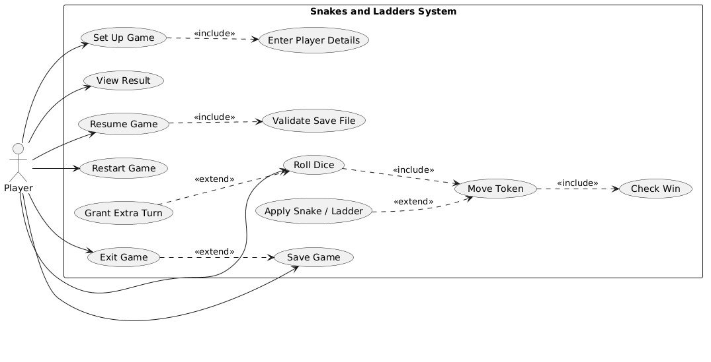

# Software Requirements Specification

## Snakes and Ladders Game
**Version**: 1.0 **Date**:29 September 2026 

| Name | SRN |
|---|---|
| Shishir Hegde | PES1UG24CS438 |
| Shaurya Singh | PES1UG24CS437 |
| Sharat Doddihal | PES1UG24CS430 |
| Shashank Palcharla | PES1UG24CS436 |
 
---

## Revision History
 
| Version | Date | Description | Author(s) |
|---|---|---|---|
| 1.0 | 29-09-2026 | Initial SRS | Team |
 
---

## 1. Introduction
 
### 1.1 Purpose
This document specifies the software requirements for a digital Snakes and Ladders game. It is intended primarily for the development team. It serves as the baseline for the Test Plan and the Software Architecture & Design Specification, both of which trace back to the requirement IDs defined here.

### 1.2 Scope
The product is a single-machine, multiplayer (hot-seat) desktop implementation of Snakes and Ladders for 2 to 4 players. The system shall:
 
- Set up a game with 2 to 4 named players.
- Simulate dice rolls, token movement, snakes, ladders, turn order, and win detection.
- Display the board and game state graphically.
- Save a game in progress and resume it later.

Out of scope: online/networked multiplayer, computer-controlled (AI) opponents, user accounts, leaderboards, and in-app purchases.

### 1.3 Definitions, Acronyms and Abbreviations
 
| Term | Definition |
|---|---|
| Board | A 10 x 10 grid of squares numbered 1 to 100 |
| Token | The on-board marker representing a player |
| Start position | Position 0, off the board, where all tokens begin |
| Snake | A connection from a higher square (head) to a lower square (tail) |
| Ladder | A connection from a lower square (base) to a higher square (top) |
| Turn | One player's sequence of roll(s) and move(s) |
| Hot-seat | Multiple players share one device and take turns |
| Overshoot | A roll that would move a token beyond square 100 |
| Save file | A local file storing a game in progress |
| FR / NFR / SEC | Functional / Non-Functional / Security requirement |
| UI | User Interface |
| RNG | Random Number Generator |

### 1.4 References
1. IEEE Std 830-1998, IEEE Recommended Practice for Software Requirements Specifications.
2. Project repository: https://github.com/niffy-artist2876/snakes-and-ladders

### 1.5 Overview
Section 2 describes the product context, users, environment and constraints. Section 3 lists the external interface, functional, non-functional and security requirements. Section 4 (Appendix) contains the use case diagram, use case descriptions and the default board configuration.

---

## 2. Overall Description
 
### 2.1 Product Perspective
The product is a new, self-contained desktop application. It does not depend on any external server or network service. It interacts only with the local operating system for display, input (mouse and keyboard) and file storage (save files).
 
### 2.2 Product Functions
At a high level, the system provides:
 
1. Game setup: player count, names, tokens and rule options.
2. Gameplay: dice rolling, token movement, snake and ladder resolution, turn management.
3. Game state display: board, tokens, turn indicator, last dice value.
4. Game end: win detection, winner announcement, final standings.
5. Session control: save, resume, restart and exit.

### 2.3 User Classes and Characteristics
 
| User class | Description |
|---|---|
| Player | Any person aged 6 and above with basic mouse/keyboard ability. No prior knowledge of the software is assumed. All players have identical privileges. |
 
There is no administrator role.

### 2.4 Operating Environment
- **OS:** Windows 10/11, Ubuntu 22.04 or later, macOS 13 or later.
- **Runtime:** Python 3.10 or later with Pygame 2.x.
- **Minimum hardware:** dual-core 2 GHz CPU, 4 GB RAM, 100 MB free disk space, display resolution of 1280 x 720 or higher.
- **Network:** not required.

### 2.5 Design and Implementation Constraints
- C1: The system shall be implemented in Python using the Pygame library.
- C2: The system shall not require an internet connection at any point.
- C3: Save files shall use the JSON format.
- C4: Game logic shall be separated from UI code so the rule engine can be unit-tested without a display.
- C5: The project shall be completed within the academic semester by a team of four.

### 2.6 Assumptions and Dependencies
- A1: All players share one device and take turns in person.
- A2: The host machine has Python and Pygame installed, or a packaged executable is provided.
- A3: The default board layout (Appendix 4.3) is used; custom board layouts are out of scope.
- A4: The OS provides a user-writable directory for save files.
---

 
## 3. Specific Requirements
 
### 3.1 External Interface Requirements
 
#### 3.1.1 User Interfaces
- UI-1: A Setup screen with controls to choose player count (2 to 4), enter names, choose token colours and toggle the extra-turn rule.
- UI-2: A Game screen showing the board, all tokens, a Roll Dice button, the last dice value, a turn indicator, and Save / Restart / Exit buttons.
- UI-3: A Result screen showing the winner and final standings, with New Game and Exit buttons.
- UI-4: A Resume option on the start screen, shown only if a valid save file exists.

#### 3.1.2 Hardware Interfaces
- Standard mouse (or trackpad) for all actions.
- Keyboard for entering player names; the Space key shall also trigger a dice roll.

#### 3.1.3 Software Interfaces
- Python 3.10+ standard library (`random`/`secrets`, `json`, `hashlib`).
- Pygame 2.x for rendering and input.
- Local file system for save files.

#### 3.1.4 Communication Interfaces
None. The system makes no network connections.
 
---

### 3.2 Functional Requirements
 
Priority: **H** = must have, **M** = should have.
 
| ID | Name | Requirement | Priority |
|---|---|---|---|
| FR-01 | Game Initialization | The system shall allow a game to be started with a minimum of 2 and a maximum of 4 players. The Start button shall remain disabled while fewer than 2 players are configured. | H |
| FR-02 | Player Setup | The system shall require each player to enter a name and shall assign each player a distinct token colour. Two players shall not be allowed the same name or colour. | H |
| FR-03 | Dice Roll | On the current player's turn, the system shall generate a uniformly random integer from 1 to 6 when the Roll Dice button is clicked or the Space key is pressed, and shall display the value. | H |
| FR-04 | Token Movement | The system shall move the current player's token forward by exactly the number of squares shown on the dice, starting from position 0 for a token that has not yet entered the board. | H |
| FR-05 | Turn Management | The system shall accept roll input only from the current player's turn, and shall pass the turn to the next player in setup order after the current player's move completes. | H |
| FR-06 | Snake Encounter | If a token's move ends on a snake's head, the system shall move the token to that snake's tail before the turn ends. | H |
| FR-07 | Ladder Encounter | If a token's move ends on a ladder's base, the system shall move the token to that ladder's top before the turn ends. | H |
| FR-08 | Extra Turn Rule | When the extra-turn option is enabled at setup, the system shall grant the current player one additional roll after rolling a 6. A player shall receive at most 2 extra rolls in a single turn. When the option is disabled, a 6 shall not grant an extra roll. | M |
| FR-09 | Win Condition Check | After every move, including snake/ladder resolution, the system shall check whether the token is on square 100 and, if so, declare that player the winner and end the game. | H |
| FR-10 | Overshoot Handling | If a roll would move a token beyond square 100, the system shall leave the token in its current position and end that player's turn. | H |
| FR-11 | Board Display | The system shall display a 10 x 10 board numbered 1 to 100 in boustrophedon order, with every snake, ladder and token visible at all times. | H |
| FR-12 | Turn Indicator | The system shall display the current player's name and token colour at all times during gameplay. | H |
| FR-13 | Game State Update | The system shall update the displayed token position within 1 second of the dice value being shown (see NFR-01). | H |
| FR-14 | Game Restart | The system shall allow the players to start a new game from the Game screen or Result screen without closing the application, after a confirmation prompt. | H |
| FR-15 | Save and Resume | The system shall allow the current game to be saved to a local file at any point between turns, and shall allow the most recent save to be resumed from the start screen with identical player names, colours, positions, rule settings and current turn. | M |
| FR-16 | Result Display | When a player wins, the system shall display the winner's name and the final standings of all players, ranked by board position in descending order. | H |
| FR-17 | Invalid Action Handling | The system shall ignore and disable the following actions: rolling when it is not the player's turn, rolling while a token is still animating, rolling after the game has ended, and saving while a move is in progress. | H |
| FR-18 | Exit Game | The system shall allow the players to exit the application at any time. If a game is in progress, the system shall first prompt the user to save, exit without saving, or cancel. | H |
 
---

### 3.3 Non-Functional Requirements
 
| ID | Category | Requirement | Measurement |
|---|---|---|---|
| NFR-01 | Performance | The system shall display the dice result and the updated token position within 1 second of a roll input, on the minimum hardware in Section 2.4. | Timed over 50 rolls; all must be at or below 1 s |
| NFR-02 | Usability | A first-time user shall be able to set up a 2-player game and complete one full turn without external help. | At least 4 of 5 first-time test users succeed within 2 minutes |
| NFR-03 | Reliability | The system shall maintain correct token positions and turn order for the full length of a game. | 100 automated full games complete with zero rule violations |
| NFR-04 | Availability | The application shall launch and reach the start screen without any network connection. | Launch test with network disabled on all 3 supported OSs |
| NFR-05 | Portability | The same source code shall run without modification on Windows 10/11, Ubuntu 22.04+ and macOS 13+. | Full smoke test passes on each OS |
| NFR-06 | Maintainability | Game rule logic shall be contained in modules that do not import Pygame, and those modules shall have at least 80% unit test statement coverage. | Coverage report from `coverage.py` |
| NFR-07 | Scalability | Performance for 4 players shall meet the same limits as for 2 players. | NFR-01 test repeated with 4 players |
| NFR-08 | Data Integrity | A saved game, when resumed, shall reproduce the exact state at save time. | 20 save/resume cycles; state compared field by field |
| NFR-09 | Compatibility | The UI shall display without clipping or overlapping elements at resolutions from 1280 x 720 up to 1920 x 1080. | Visual check at 1280x720, 1366x768, 1920x1080 |
| NFR-10 | Error Handling | The application shall not crash on invalid input or on a missing, empty or corrupted save file; it shall show an error message and return to a usable screen. | Fault-injection tests; zero unhandled exceptions |
| NFR-11 | Recoverability | If the application is closed during a save operation, the previous valid save file shall remain loadable. | Save interrupted 10 times; previous save loads each time |
| NFR-12 | Responsiveness | Token movement animation shall render at a minimum of 30 frames per second. | Frame rate logged during 20 moves on minimum hardware |
| NFR-13 | Accessibility | All text shall be at least 14 pt, and token colours shall be distinguishable by users with common colour vision deficiency (each token also carries a distinct number label). | Checked against a colour-blindness simulator |
| NFR-14 | Resource Efficiency | During gameplay the application shall use no more than 200 MB of RAM and each save file shall not exceed 10 KB. | Measured via OS task manager and file size |
| NFR-15 | Randomness Quality | Dice outcomes shall be uniformly distributed across 1 to 6. | Chi-square test on 60,000 rolls passes at 5% significance |
 
---

### 3.4 Security Requirements
 
The system is an offline, single-device game with no accounts. The relevant threats are tampering with saved games, manipulation of dice outcomes, and malformed input that could crash the application.

#### 3.4.1 Security Objectives
 
| ID | Objective |
|---|---|
| SO-1 | **Integrity of game state:** saved games shall not be silently altered between saving and resuming. |
| SO-2 | **Fairness:** no player shall be able to influence or predict dice outcomes through the application. |
| SO-3 | **Robustness against malformed input:** no user input or input file shall cause a crash, code execution or invalid game state. |
| SO-4 | **Minimal attack surface:** the application shall not expose any network interface. |

#### 3.4.2 Security Requirements
 
| ID | Requirement | Objective |
|---|---|---|
| SEC-01 | The system shall accept player names only if they contain 1 to 15 characters from the set A–Z, a–z, 0–9 and space. Other input shall be rejected with an error message. | SO-3 |
| SEC-02 | The system shall store a SHA-256 checksum of the game state in every save file, and shall refuse to load a save file whose recomputed checksum does not match, displaying "Save file is corrupted or has been modified." | SO-1 |
| SEC-03 | Before loading a save file, the system shall validate that it is at most 10 KB, is valid JSON, and that every field is within range (2 to 4 players, positions 0 to 100, valid turn index). Invalid files shall be rejected without altering the current state. | SO-1, SO-3 |
| SEC-04 | Dice values shall be generated only by the game engine's RNG. No UI element, keyboard input or file shall provide a path to set or modify a dice value. | SO-2 |
| SEC-05 | Save files shall be parsed with a data-only JSON parser. The system shall not use `eval`, `exec` or `pickle` on any file or user input. | SO-3 |
| SEC-06 | The application shall not open any network socket or make any network request. | SO-4 |
 
---

## 4. Appendix
 
### 4.1 Use Case Diagram

### 4.2 Use Case Descriptions
 
**UC3: Roll Dice**
 
| Field | Description |
|---|---|
| Actor | Player (current) |
| Precondition | A game is in progress, it is the actor's turn, no animation is running |
| Main flow | 1. Player clicks Roll Dice or presses Space. 2. System generates a value 1 to 6 and displays it. 3. System moves the token (UC4). 4. System resolves any snake or ladder (UC5). 5. System checks for a win (UC7). 6. System passes the turn to the next player. |
| Alternate flow | 2a. Roll would overshoot 100: token stays, turn passes (FR-10). 5a. Player has won: go to UC8. 6a. Value is 6 and extra-turn is enabled: player rolls again (UC6), up to the limit in FR-08. |
| Postcondition | Token position and current turn are updated |
| Related requirements | FR-03, FR-04, FR-05, FR-06, FR-07, FR-08, FR-09, FR-10, SEC-04 |
 
**UC10: Resume Game**
 
| Field | Description |
|---|---|
| Actor | Player |
| Precondition | Application is at the start screen and a save file exists |
| Main flow | 1. Player clicks Resume. 2. System validates the save file (UC13). 3. System restores the saved state. 4. Game screen opens on the saved player's turn. |
| Alternate flow | 2a. Validation fails: system shows an error and remains on the start screen. |
| Postcondition | Game state equals the state at save time |
| Related requirements | FR-15, NFR-08, SEC-02, SEC-03, SEC-05 |
 
### 4.3 Default Board Configuration
 
| Ladders (base → top) | Snakes (head → tail) |
|---|---|
| 1 → 38 | 17 → 7 |
| 4 → 14 | 54 → 34 |
| 9 → 31 | 62 → 19 |
| 21 → 42 | 64 → 60 |
| 28 → 84 | 87 → 36 |
| 51 → 67 | 93 → 73 |
| 72 → 91 | 95 → 75 |
| 80 → 99 | 98 → 79 |
 
No square is both a snake head and a ladder base, and no snake tail or ladder top lands on another snake head or ladder base.

